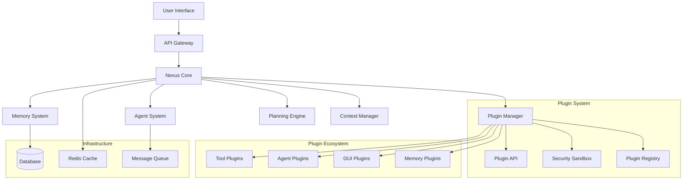

# Architecture Overview

Nexus AI is built with a modular, extensible architecture that enables powerful AI workflows while maintaining security, performance, and scalability.

## System Architecture

## Core Components

### Agent System
Multi-agent orchestration with specialized roles:
- **Navigator**: Strategic planning and coordination
- **Artisan**: Code generation and execution
- **Advisor**: Analysis and recommendations
- **Archivist**: Knowledge management

### Memory System
Persistent, searchable memory with:
- **Episodic Memory**: Experience and interaction history
- **Semantic Memory**: Facts and knowledge
- **Working Memory**: Current context and state
- **Meta-Memory**: Self-reflection and learning

### Planning Engine
Hierarchical planning with:
- **Goal Decomposition**: Breaking complex tasks into subtasks
- **Resource Allocation**: Managing computational resources
- **Timeline Management**: Scheduling and prioritization
- **Adaptation**: Dynamic replanning based on results

### Plugin System
**Revolutionary extensibility architecture** featuring:
- **Security Sandbox**: Isolated execution environment
- **Permission System**: Granular access control
- **Lifecycle Management**: Load, activate, deactivate, unload
- **API Layer**: Secure communication bridge

## Design Principles

### 🔒 Security First
- Sandboxed plugin execution
- Permission-based access control
- Input validation and sanitization
- Encrypted communication

### 🚀 Performance Optimized
- Asynchronous processing
- Efficient caching strategies
- Resource monitoring
- Scalable architecture

### 🔌 Extensible by Design
- Plugin-based architecture
- Well-defined APIs
- Hot-swappable components
- Backward compatibility

### 🛡️ Fault Tolerant
- Graceful error handling
- Circuit breaker patterns
- Health monitoring
- Automatic recovery

## Technology Stack

### Core Technologies
- **Python 3.8+**: Primary language
- **FastAPI**: High-performance API framework
- **SQLite/PostgreSQL**: Data persistence
- **Redis**: Caching and message queuing
- **Docker**: Containerization

### Plugin Technologies
- **Streamlit**: Web UI framework
- **WebSockets**: Real-time communication
- **YAML**: Configuration management
- **JSON Schema**: Validation

### AI/ML Integration
- **OpenAI API**: Language model integration
- **Anthropic Claude**: Advanced reasoning
- **Local Models**: Privacy-focused options
- **Vector Databases**: Semantic search

This architecture enables Nexus AI to be both powerful and flexible, supporting everything from simple automation to complex multi-agent workflows.