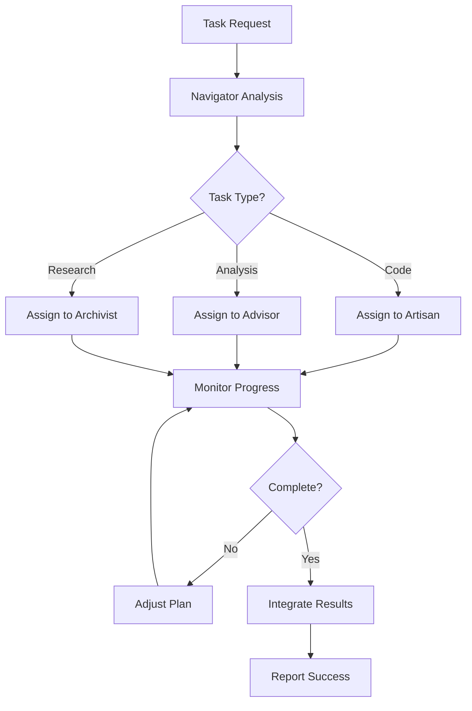

# Agent System

The Nexus AI agent system provides sophisticated multi-agent orchestration, where specialized AI agents work together to accomplish complex tasks through coordination and collaboration.

## Agent Types

### Navigator Agent
**Role**: Strategic planning and task coordination

The Navigator serves as the primary coordinator, responsible for:
- Breaking down complex goals into manageable tasks
- Coordinating work between other agents
- Monitoring progress and adjusting plans
- Making high-level strategic decisions

```python
# Navigator agent capabilities
navigator_capabilities = [
    "strategic_planning",
    "task_decomposition", 
    "agent_coordination",
    "progress_monitoring",
    "decision_making"
]
```

### Artisan Agent
**Role**: Code generation and execution

The Artisan specializes in creating and implementing solutions:
- Writing code in multiple languages
- Executing scripts and programs
- Building applications and tools
- Technical implementation

### Advisor Agent
**Role**: Analysis and recommendations

The Advisor provides insights and guidance:
- Analyzing data and situations
- Providing recommendations
- Risk assessment
- Quality review and validation

### Archivist Agent
**Role**: Knowledge management

The Archivist manages information and memory:
- Storing and retrieving information
- Managing knowledge bases
- Organizing documentation
- Historical context and learning

## Agent Communication

### Message Passing
Agents communicate through structured messages:

```python
class AgentMessage:
    sender: str
    recipient: str
    message_type: str
    content: Dict[str, Any]
    timestamp: datetime
    priority: int
```

### Coordination Protocols
- **Request/Response**: Direct communication between agents
- **Broadcast**: Messages sent to all agents
- **Subscribe/Notify**: Event-driven communication
- **Consensus**: Collaborative decision making

## Agent Orchestration

### Task Distribution
The Navigator distributes tasks based on:
- Agent capabilities and expertise
- Current workload and availability
- Task complexity and requirements
- Dependencies between tasks

### Workflow Management


## Plugin Integration

### Agent Plugins
Extend the agent system with specialized agents:

```python
class CustomAgentPlugin(AgentPlugin):
    """Custom agent with domain-specific capabilities."""
    
    async def process_message(self, message: str, context: Dict[str, Any]) -> str:
        # Implement custom agent logic
        return response
    
    def get_agent_config(self) -> Dict[str, Any]:
        return {
            "name": "Custom Specialist",
            "role": "domain_expert",
            "capabilities": ["specialized_task_1", "specialized_task_2"]
        }
```

### Tool Integration
Agents can use tools through the plugin system:
- Web search and data gathering
- File manipulation and processing
- API integrations
- External service connections

## Agent Learning

### Experience Collection
Agents learn from their interactions:
- Success and failure patterns
- Performance metrics
- User feedback
- Environmental changes

### Knowledge Sharing
Agents share knowledge through:
- Shared memory systems
- Collaborative learning
- Best practice documentation
- Pattern recognition

## Configuration and Management

### Agent Configuration
```yaml
agents:
  navigator:
    model: "gpt-4"
    temperature: 0.7
    max_tokens: 2000
    capabilities:
      - "planning"
      - "coordination"
  
  artisan:
    model: "claude-3"
    temperature: 0.3
    max_tokens: 4000
    capabilities:
      - "coding"
      - "execution"
```

### Performance Monitoring
- Task completion rates
- Response times
- Resource utilization
- Quality metrics

The agent system is designed to be both powerful and flexible, enabling complex multi-agent workflows while maintaining clear separation of concerns and efficient coordination.