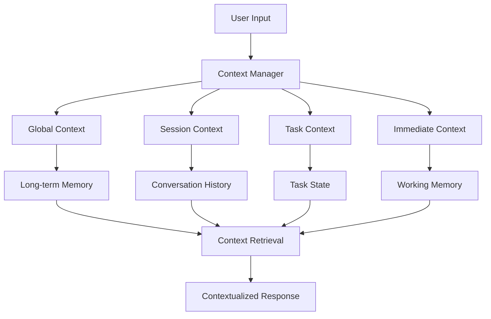

# Context Management

The Nexus AI context management system maintains intelligent state across conversations, tasks, and agent interactions, ensuring coherent and contextually aware responses while optimizing memory usage and performance.

## Context Architecture

### Context Layers
Multi-layered context management:



### Context Types

#### Global Context
Persistent context across all interactions:
- User preferences and settings
- Historical interaction patterns
- Learned user behavior
- System-wide state

#### Session Context
Context for current conversation session:
- Conversation history
- Current topics and themes
- Established facts and assumptions
- Session-specific preferences

#### Task Context
Context for specific tasks:
- Task objectives and requirements
- Progress and intermediate results
- Resource allocations
- Dependencies and constraints

#### Immediate Context
Working memory for current processing:
- Current message and response
- Active variables and calculations
- Temporary state and data
- Real-time context

## Context Management

### Context Builder
Intelligent context assembly:

```python
class ContextBuilder:
    """Builds comprehensive context for agent responses."""
    
    def __init__(self, memory_system, max_context_length: int = 8000):
        self.memory_system = memory_system
        self.max_context_length = max_context_length
    
    async def build_context(
        self,
        user_input: str,
        session_id: str,
        task_id: Optional[str] = None
    ) -> Context:
        """Build comprehensive context for response generation."""
        
        context = Context()
        
        # Add immediate context
        context.immediate = ImmediateContext(
            user_input=user_input,
            timestamp=datetime.now(),
            session_id=session_id,
            task_id=task_id
        )
        
        # Retrieve relevant memories
        relevant_memories = await self.memory_system.retrieve_memories(
            query=user_input,
            limit=5,
            min_relevance=0.7
        )
        context.memories = relevant_memories
        
        # Get session context
        context.session = await self.get_session_context(session_id)
        
        # Get task context if applicable
        if task_id:
            context.task = await self.get_task_context(task_id)
        
        # Get global context
        context.global_context = await self.get_global_context(session_id)
        
        # Optimize context length
        context = self.optimize_context_length(context)
        
        return context
```

### Context Optimization
Smart context length management:

```python
class ContextOptimizer:
    """Optimizes context to fit within length constraints."""
    
    def optimize_context(self, context: Context, max_length: int) -> Context:
        """Optimize context while preserving important information."""
        
        # Calculate current length
        current_length = self.calculate_context_length(context)
        
        if current_length <= max_length:
            return context
        
        # Prioritize context components
        priorities = {
            "immediate": 1.0,      # Always include
            "task": 0.9,           # High priority if task active
            "session": 0.8,        # Recent conversation history
            "memories": 0.7,       # Relevant memories
            "global": 0.5          # Background context
        }
        
        optimized_context = Context()
        remaining_length = max_length
        
        # Add components by priority
        for component, priority in sorted(priorities.items(), key=lambda x: x[1], reverse=True):
            component_data = getattr(context, component)
            component_length = self.calculate_component_length(component_data)
            
            if component_length <= remaining_length:
                setattr(optimized_context, component, component_data)
                remaining_length -= component_length
            else:
                # Truncate component if possible
                truncated_data = self.truncate_component(component_data, remaining_length)
                if truncated_data:
                    setattr(optimized_context, component, truncated_data)
                break
        
        return optimized_context
```

## Context Persistence

### Session Management
Managing conversation sessions:

```python
class SessionManager:
    """Manages conversation sessions and their context."""
    
    def __init__(self, storage_backend):
        self.storage = storage_backend
        self.active_sessions = {}
    
    async def create_session(self, user_id: str) -> str:
        """Create new conversation session."""
        session_id = generate_session_id()
        
        session = ConversationSession(
            session_id=session_id,
            user_id=user_id,
            created_at=datetime.now(),
            last_activity=datetime.now(),
            context=SessionContext(),
            messages=[],
            metadata={}
        )
        
        self.active_sessions[session_id] = session
        await self.storage.save_session(session)
        
        return session_id
    
    async def update_session(self, session_id: str, message: Message):
        """Update session with new message."""
        session = await self.get_session(session_id)
        
        # Add message to history
        session.messages.append(message)
        session.last_activity = datetime.now()
        
        # Update context
        await self.update_session_context(session, message)
        
        # Save to storage
        await self.storage.save_session(session)
    
    async def update_session_context(self, session: ConversationSession, message: Message):
        """Update session context based on new message."""
        
        # Extract entities and topics
        entities = await self.extract_entities(message.content)
        topics = await self.extract_topics(message.content)
        
        # Update context
        session.context.entities.update(entities)
        session.context.topics.extend(topics)
        session.context.current_topic = self.identify_current_topic(topics)
        
        # Maintain context window
        if len(session.messages) > session.context.max_history:
            session.messages = session.messages[-session.context.max_history:]
```

### Task Context Management
Managing task-specific context:

```python
class TaskContextManager:
    """Manages context for specific tasks."""
    
    async def create_task_context(self, task_id: str, task_definition: Dict[str, Any]) -> TaskContext:
        """Create context for a new task."""
        
        context = TaskContext(
            task_id=task_id,
            created_at=datetime.now(),
            objectives=task_definition.get("objectives", []),
            requirements=task_definition.get("requirements", {}),
            constraints=task_definition.get("constraints", {}),
            resources=task_definition.get("resources", {}),
            progress=TaskProgress(),
            state={}
        )
        
        return context
    
    async def update_task_progress(self, task_id: str, progress_update: Dict[str, Any]):
        """Update task context with progress information."""
        
        context = await self.get_task_context(task_id)
        
        # Update progress
        context.progress.completed_steps.extend(
            progress_update.get("completed_steps", [])
        )
        context.progress.current_step = progress_update.get("current_step")
        context.progress.percentage = progress_update.get("percentage", 0)
        
        # Update state
        context.state.update(progress_update.get("state_changes", {}))
        context.last_updated = datetime.now()
        
        await self.save_task_context(context)
```

## Context-Aware Processing

### Contextual Response Generation
Using context to generate appropriate responses:

```python
class ContextualResponseGenerator:
    """Generates responses using comprehensive context."""
    
    async def generate_response(
        self,
        user_input: str,
        context: Context,
        agent_config: Dict[str, Any]
    ) -> str:
        """Generate contextually aware response."""
        
        # Prepare prompt with context
        prompt = self.build_contextual_prompt(user_input, context)
        
        # Configure agent based on context
        agent_params = self.adjust_agent_parameters(agent_config, context)
        
        # Generate response
        response = await self.language_model.generate(
            prompt=prompt,
            **agent_params
        )
        
        # Post-process with context
        processed_response = await self.post_process_response(
            response, context
        )
        
        return processed_response
    
    def build_contextual_prompt(self, user_input: str, context: Context) -> str:
        """Build prompt incorporating relevant context."""
        
        prompt_parts = []
        
        # System context
        if context.global_context:
            prompt_parts.append(f"System context: {context.global_context.summary}")
        
        # Task context
        if context.task:
            prompt_parts.append(f"Current task: {context.task.objectives}")
            prompt_parts.append(f"Task progress: {context.task.progress.percentage}%")
        
        # Conversation history
        if context.session and context.session.recent_messages:
            prompt_parts.append("Recent conversation:")
            for msg in context.session.recent_messages[-3:]:
                prompt_parts.append(f"- {msg.role}: {msg.content}")
        
        # Relevant memories
        if context.memories:
            prompt_parts.append("Relevant information:")
            for memory in context.memories[:3]:
                prompt_parts.append(f"- {memory.content}")
        
        # Current input
        prompt_parts.append(f"User: {user_input}")
        prompt_parts.append("Assistant:")
        
        return "\n".join(prompt_parts)
```

### Context-Based Routing
Routing requests based on context:

```python
class ContextualRouter:
    """Routes requests to appropriate agents based on context."""
    
    async def route_request(
        self,
        user_input: str,
        context: Context
    ) -> AgentAssignment:
        """Route request to most appropriate agent."""
        
        # Analyze request type
        request_type = await self.classify_request(user_input)
        
        # Consider task context
        if context.task:
            # Check if request relates to current task
            if self.is_task_related(user_input, context.task):
                # Route to task-assigned agent
                return AgentAssignment(
                    agent_id=context.task.assigned_agent,
                    confidence=0.9,
                    reason="Task continuity"
                )
        
        # Consider conversation context
        if context.session:
            # Check for conversation continuity
            last_agent = context.session.last_agent
            if self.is_conversation_continuation(user_input, context.session):
                return AgentAssignment(
                    agent_id=last_agent,
                    confidence=0.8,
                    reason="Conversation continuity"
                )
        
        # Route based on request type
        suitable_agents = self.get_agents_for_request_type(request_type)
        best_agent = self.select_best_agent(suitable_agents, context)
        
        return AgentAssignment(
            agent_id=best_agent.id,
            confidence=0.7,
            reason=f"Best fit for {request_type}"
        )
```

## Performance Optimization

### Context Caching
Efficient context caching strategies:

```python
class ContextCache:
    """Caches context data for performance optimization."""
    
    def __init__(self, redis_client):
        self.redis = redis_client
        self.cache_ttl = 3600  # 1 hour
    
    async def get_cached_context(self, context_key: str) -> Optional[Context]:
        """Retrieve context from cache."""
        cached_data = await self.redis.get(f"context:{context_key}")
        
        if cached_data:
            return Context.from_json(cached_data)
        
        return None
    
    async def cache_context(self, context_key: str, context: Context):
        """Cache context data."""
        await self.redis.setex(
            f"context:{context_key}",
            self.cache_ttl,
            context.to_json()
        )
```

### Context Compression
Compressing context for efficiency:

```python
class ContextCompressor:
    """Compresses context while preserving essential information."""
    
    async def compress_context(self, context: Context) -> CompressedContext:
        """Compress context using various techniques."""
        
        compressed = CompressedContext()
        
        # Summarize long text
        if context.session and len(context.session.messages) > 10:
            compressed.session_summary = await self.summarize_conversation(
                context.session.messages
            )
        
        # Extract key entities and topics
        compressed.key_entities = self.extract_key_entities(context)
        compressed.main_topics = self.extract_main_topics(context)
        
        # Preserve critical task information
        if context.task:
            compressed.task_essentials = {
                "objectives": context.task.objectives,
                "current_progress": context.task.progress.percentage,
                "critical_state": context.task.state
            }
        
        return compressed
```

The context management system ensures that agents have access to the right information at the right time, enabling coherent and intelligent interactions while maintaining optimal performance.