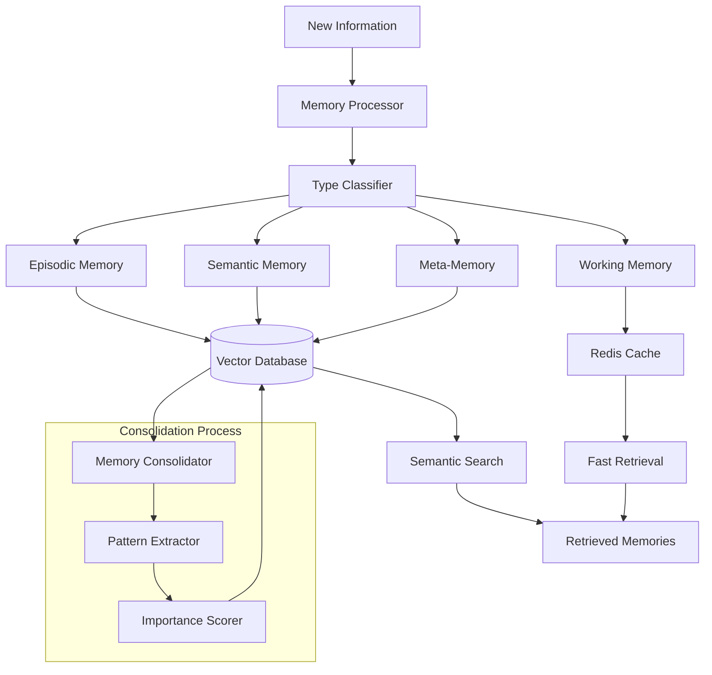

# Memory System

The Nexus AI memory system provides sophisticated memory management capabilities, enabling agents to store, retrieve, and learn from experiences while maintaining context across interactions.

## Memory Types

### Episodic Memory
**Stores**: Specific experiences and interactions
- Conversation history
- Task execution records
- Decision-making processes
- Outcomes and results

```python
class EpisodicMemory:
    timestamp: datetime
    context: Dict[str, Any]
    action: str
    outcome: str
    participants: List[str]
    emotions: Dict[str, float]
```

### Semantic Memory
**Stores**: Facts, concepts, and general knowledge
- Learned facts and rules
- Conceptual relationships
- Domain knowledge
- Procedural information

### Working Memory
**Stores**: Current context and active information
- Current task state
- Active variables and data
- Immediate goals
- Temporary calculations

### Meta-Memory
**Stores**: Knowledge about memory itself
- Learning patterns
- Memory effectiveness
- Retrieval strategies
- Self-reflection records

## Memory Operations

### Storage
Efficient storage with automatic categorization:

```python
async def store_memory(
    content: str,
    memory_type: MemoryType,
    context: Dict[str, Any],
    importance: float = 0.5
) -> str:
    """Store a memory with metadata."""
    memory_entry = MemoryEntry(
        id=generate_id(),
        content=content,
        type=memory_type,
        context=context,
        importance=importance,
        timestamp=datetime.now(),
        embeddings=generate_embeddings(content)
    )
    return await memory_store.save(memory_entry)
```

### Retrieval
Advanced search and retrieval capabilities:

```python
async def retrieve_memories(
    query: str,
    memory_types: List[MemoryType] = None,
    limit: int = 10,
    min_relevance: float = 0.7
) -> List[MemoryEntry]:
    """Retrieve relevant memories."""
    # Semantic search using embeddings
    query_embedding = generate_embeddings(query)
    
    # Search across memory types
    results = await memory_store.search(
        embedding=query_embedding,
        types=memory_types,
        limit=limit,
        threshold=min_relevance
    )
    
    return results
```

### Consolidation
Periodic memory consolidation for efficiency:
- Importance-based retention
- Pattern extraction
- Redundancy removal
- Long-term storage optimization

## Memory Architecture



## Memory Plugins

### Vector Memory Plugin
Enhanced semantic memory with vector embeddings:

```python
class VectorMemoryPlugin(MemoryPlugin):
    """Vector-based semantic memory storage."""
    
    async def store_memory(self, content: str, metadata: Dict[str, Any]) -> str:
        """Store memory with vector embeddings."""
        embedding = await self.generate_embedding(content)
        
        memory_record = {
            "content": content,
            "metadata": metadata,
            "embedding": embedding,
            "timestamp": datetime.now().isoformat()
        }
        
        return await self.vector_db.insert(memory_record)
    
    async def retrieve_memories(self, query: str, limit: int = 10) -> List[Dict[str, Any]]:
        """Semantic search and retrieval."""
        query_embedding = await self.generate_embedding(query)
        
        results = await self.vector_db.similarity_search(
            embedding=query_embedding,
            limit=limit
        )
        
        return [
            {
                "content": result["content"],
                "metadata": result["metadata"],
                "relevance": result["similarity_score"]
            }
            for result in results
        ]
```

### Graph Memory Plugin
Relationship-based memory storage:

```python
class GraphMemoryPlugin(MemoryPlugin):
    """Graph-based memory with entity relationships."""
    
    async def store_memory(self, content: str, metadata: Dict[str, Any]) -> str:
        """Store memory as graph nodes and relationships."""
        entities = await self.extract_entities(content)
        relationships = await self.extract_relationships(content, entities)
        
        # Create nodes for entities
        for entity in entities:
            await self.graph_db.create_node(entity)
        
        # Create relationships
        for relationship in relationships:
            await self.graph_db.create_relationship(relationship)
        
        return f"graph_memory_{uuid.uuid4()}"
```

## Memory Management

### Importance Scoring
Automatic scoring based on multiple factors:

```python
def calculate_importance(memory: MemoryEntry) -> float:
    """Calculate memory importance score."""
    factors = {
        "recency": calculate_recency_score(memory.timestamp),
        "frequency": calculate_frequency_score(memory.content),
        "emotional_weight": calculate_emotional_score(memory.context),
        "outcome_significance": calculate_outcome_score(memory.outcome),
        "user_feedback": calculate_feedback_score(memory.feedback)
    }
    
    # Weighted combination
    importance = (
        factors["recency"] * 0.2 +
        factors["frequency"] * 0.3 +
        factors["emotional_weight"] * 0.2 +
        factors["outcome_significance"] * 0.2 +
        factors["user_feedback"] * 0.1
    )
    
    return min(max(importance, 0.0), 1.0)
```

### Memory Cleanup
Periodic cleanup to maintain performance:
- Remove low-importance memories
- Consolidate similar memories
- Archive old memories
- Optimize storage

## Context Management

### Context Windows
Dynamic context management for conversations:

```python
class ContextManager:
    """Manages conversation context and memory integration."""
    
    def __init__(self, max_context_length: int = 8000):
        self.max_context_length = max_context_length
        self.current_context = []
    
    async def build_context(self, query: str) -> str:
        """Build context from relevant memories."""
        # Retrieve relevant memories
        memories = await retrieve_memories(query, limit=5)
        
        # Add to current context
        context_parts = []
        context_parts.append(f"Current query: {query}")
        
        if memories:
            context_parts.append("Relevant memories:")
            for memory in memories:
                context_parts.append(f"- {memory.content}")
        
        # Add conversation history
        if self.current_context:
            context_parts.append("Recent conversation:")
            context_parts.extend(self.current_context[-3:])  # Last 3 exchanges
        
        full_context = "\n".join(context_parts)
        
        # Truncate if too long
        if len(full_context) > self.max_context_length:
            full_context = full_context[:self.max_context_length] + "..."
        
        return full_context
```

## Performance Optimization

### Caching Strategies
- **Hot Memory**: Frequently accessed memories in cache
- **LRU Eviction**: Least recently used memories removed first
- **Preloading**: Predictive loading of relevant memories

### Indexing
- **Semantic Indexes**: Vector-based similarity search
- **Temporal Indexes**: Time-based retrieval
- **Category Indexes**: Type-based organization
- **Importance Indexes**: Priority-based access

The memory system is designed to provide both powerful storage capabilities and intelligent retrieval, enabling agents to learn and improve over time while maintaining efficient performance.