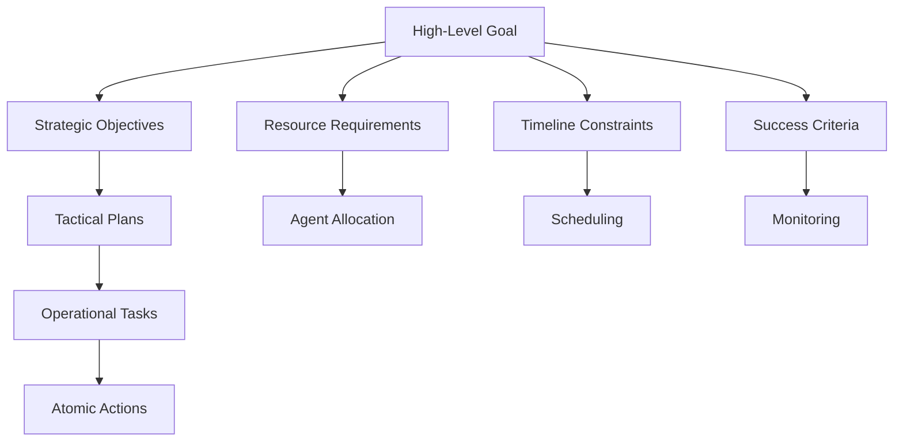

# Planning Engine

The Nexus AI planning engine provides sophisticated hierarchical planning capabilities, enabling the system to break down complex goals into manageable tasks and coordinate their execution across multiple agents.

## Planning Architecture

### Hierarchical Planning
Multi-level goal decomposition:



### Plan Representation
Plans are represented as structured trees:

```python
class Plan:
    id: str
    name: str
    description: str
    goal: Goal
    tasks: List[Task]
    dependencies: List[Dependency]
    resources: ResourceRequirements
    timeline: Timeline
    success_criteria: List[Criterion]
    
class Task:
    id: str
    name: str
    description: str
    type: TaskType
    agent_assignment: Optional[str]
    prerequisites: List[str]
    estimated_duration: timedelta
    priority: int
    status: TaskStatus
```

## Planning Process

### 1. Goal Analysis
Initial analysis of the user's goal:

```python
async def analyze_goal(goal_description: str) -> GoalAnalysis:
    """Analyze and structure a user goal."""
    analysis = GoalAnalysis(
        original_description=goal_description,
        goal_type=classify_goal_type(goal_description),
        complexity=estimate_complexity(goal_description),
        domain=identify_domain(goal_description),
        constraints=extract_constraints(goal_description),
        success_criteria=derive_success_criteria(goal_description)
    )
    
    return analysis
```

### 2. Decomposition Strategy
Breaking goals into manageable components:

```python
async def decompose_goal(goal: Goal) -> List[Subgoal]:
    """Decompose a goal into subgoals using various strategies."""
    
    strategies = [
        temporal_decomposition,    # Break by time/sequence
        functional_decomposition,  # Break by function/capability
        domain_decomposition,     # Break by domain/expertise
        resource_decomposition    # Break by resource requirements
    ]
    
    best_strategy = select_decomposition_strategy(goal)
    subgoals = await best_strategy(goal)
    
    return validate_decomposition(subgoals)
```

### 3. Task Planning
Converting subgoals into executable tasks:

```python
async def create_task_plan(subgoals: List[Subgoal]) -> TaskPlan:
    """Create detailed task plan from subgoals."""
    
    tasks = []
    for subgoal in subgoals:
        # Generate tasks for each subgoal
        subgoal_tasks = await generate_tasks(subgoal)
        tasks.extend(subgoal_tasks)
    
    # Analyze dependencies
    dependencies = analyze_task_dependencies(tasks)
    
    # Optimize task order
    optimized_order = optimize_execution_order(tasks, dependencies)
    
    return TaskPlan(
        tasks=tasks,
        dependencies=dependencies,
        execution_order=optimized_order,
        estimated_duration=calculate_total_duration(tasks),
        resource_requirements=aggregate_resources(tasks)
    )
```

## Planning Algorithms

### Hierarchical Task Network (HTN)
Systematic decomposition using predefined methods:

```python
class HTNPlanner:
    """Hierarchical Task Network planner."""
    
    def __init__(self):
        self.methods = {}  # Task decomposition methods
        self.operators = {}  # Primitive operations
    
    async def plan(self, tasks: List[Task], state: State) -> Plan:
        """Generate plan using HTN planning."""
        plan = Plan()
        
        for task in tasks:
            if task.is_primitive():
                # Direct execution
                plan.add_action(task)
            else:
                # Decompose using methods
                subtasks = await self.decompose(task, state)
                subplan = await self.plan(subtasks, state)
                plan.merge(subplan)
        
        return plan
```

### Forward Chaining
Goal-directed planning with forward search:

```python
class ForwardChainPlanner:
    """Forward chaining planner."""
    
    async def plan(self, initial_state: State, goal: Goal) -> Plan:
        """Plan from initial state to goal."""
        frontier = [initial_state]
        explored = set()
        plan = Plan()
        
        while frontier:
            current_state = frontier.pop(0)
            
            if self.satisfies_goal(current_state, goal):
                return plan
            
            if current_state in explored:
                continue
            
            explored.add(current_state)
            
            # Generate successor states
            for action in self.get_applicable_actions(current_state):
                new_state = self.apply_action(current_state, action)
                if new_state not in explored:
                    frontier.append(new_state)
                    plan.add_action(action)
        
        return None  # No plan found
```

## Resource Management

### Resource Allocation
Intelligent allocation of agents and resources:

```python
class ResourceAllocator:
    """Manages resource allocation for plan execution."""
    
    def __init__(self):
        self.available_agents = {}
        self.resource_constraints = {}
    
    async def allocate_resources(self, plan: Plan) -> AllocationResult:
        """Allocate resources to plan tasks."""
        allocation = {}
        
        for task in plan.tasks:
            # Find suitable agents
            suitable_agents = self.find_suitable_agents(task)
            
            if not suitable_agents:
                return AllocationResult(
                    success=False,
                    error=f"No suitable agents for task: {task.name}"
                )
            
            # Select best agent based on criteria
            selected_agent = self.select_best_agent(
                task, suitable_agents
            )
            
            allocation[task.id] = selected_agent
            self.reserve_agent(selected_agent, task.estimated_duration)
        
        return AllocationResult(
            success=True,
            allocation=allocation
        )
```

### Scheduling
Timeline management and task scheduling:

```python
class TaskScheduler:
    """Schedules task execution with dependency management."""
    
    async def create_schedule(self, tasks: List[Task], dependencies: List[Dependency]) -> Schedule:
        """Create execution schedule respecting dependencies."""
        
        # Topological sort for dependency ordering
        ordered_tasks = self.topological_sort(tasks, dependencies)
        
        schedule = Schedule()
        current_time = datetime.now()
        
        for task in ordered_tasks:
            # Find earliest possible start time
            earliest_start = self.calculate_earliest_start(
                task, dependencies, schedule
            )
            
            # Schedule task
            start_time = max(current_time, earliest_start)
            end_time = start_time + task.estimated_duration
            
            schedule.add_task_slot(
                task=task,
                start_time=start_time,
                end_time=end_time
            )
            
            current_time = end_time
        
        return schedule
```

## Adaptive Planning

### Plan Monitoring
Continuous monitoring of plan execution:

```python
class PlanMonitor:
    """Monitors plan execution and detects deviations."""
    
    async def monitor_execution(self, plan: Plan) -> MonitoringResult:
        """Monitor ongoing plan execution."""
        issues = []
        
        for task in plan.tasks:
            if task.status == TaskStatus.IN_PROGRESS:
                # Check for delays
                if self.is_delayed(task):
                    issues.append(DelayIssue(task))
                
                # Check for resource problems
                if self.has_resource_issues(task):
                    issues.append(ResourceIssue(task))
                
                # Check for quality problems
                if self.has_quality_issues(task):
                    issues.append(QualityIssue(task))
        
        return MonitoringResult(
            overall_status=self.calculate_overall_status(plan),
            issues=issues,
            recommendations=self.generate_recommendations(issues)
        )
```

### Plan Adaptation
Dynamic replanning when issues are detected:

```python
class PlanAdapter:
    """Adapts plans based on execution feedback."""
    
    async def adapt_plan(self, plan: Plan, issues: List[Issue]) -> Plan:
        """Adapt plan to address identified issues."""
        
        adapted_plan = plan.copy()
        
        for issue in issues:
            if isinstance(issue, DelayIssue):
                # Rebalance resources or adjust timeline
                adapted_plan = await self.handle_delay(adapted_plan, issue)
            
            elif isinstance(issue, ResourceIssue):
                # Reallocate resources or find alternatives
                adapted_plan = await self.handle_resource_issue(adapted_plan, issue)
            
            elif isinstance(issue, QualityIssue):
                # Add quality checks or revise approach
                adapted_plan = await self.handle_quality_issue(adapted_plan, issue)
        
        return adapted_plan
```

## Planning Strategies

### Domain-Specific Planning
Specialized planning for different domains:

```python
class CodeGenerationPlanner(DomainPlanner):
    """Specialized planner for code generation tasks."""
    
    async def plan_code_generation(self, requirements: CodeRequirements) -> Plan:
        """Create plan for code generation project."""
        
        phases = [
            "requirements_analysis",
            "architecture_design", 
            "implementation",
            "testing",
            "documentation"
        ]
        
        plan = Plan()
        for phase in phases:
            phase_tasks = await self.generate_phase_tasks(phase, requirements)
            plan.add_tasks(phase_tasks)
        
        return plan

class ResearchPlanner(DomainPlanner):
    """Specialized planner for research tasks."""
    
    async def plan_research(self, research_question: str) -> Plan:
        """Create plan for research project."""
        
        methodology = await self.select_research_methodology(research_question)
        
        if methodology == "systematic_review":
            return await self.plan_systematic_review(research_question)
        elif methodology == "experimental":
            return await self.plan_experimental_research(research_question)
        else:
            return await self.plan_exploratory_research(research_question)
```

## Integration with Plugin System

### Planning Plugins
Extend planning capabilities through plugins:

```python
class PlanningPlugin(BasePlugin):
    """Base class for planning plugins."""
    
    async def plan(self, goal: Goal, context: Dict[str, Any]) -> Plan:
        """Generate plan for the given goal."""
        raise NotImplementedError
    
    async def estimate_duration(self, task: Task) -> timedelta:
        """Estimate task execution duration."""
        raise NotImplementedError
    
    async def validate_plan(self, plan: Plan) -> ValidationResult:
        """Validate plan feasibility and quality."""
        raise NotImplementedError
```

The planning engine provides the intelligence needed to break down complex goals into actionable plans while maintaining flexibility to adapt to changing conditions and requirements.