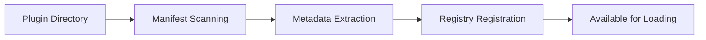
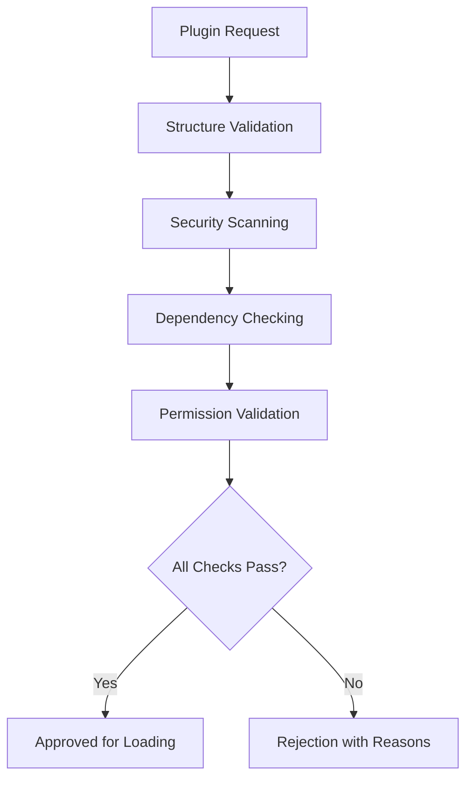

# Plugin Architecture

The Nexus AI plugin architecture is designed from the ground up to provide secure, performant, and flexible extensibility. This document explores the technical architecture and design decisions that make the plugin system both powerful and safe.

## Architectural Principles

### 🔒 Security First
- **Sandboxed Execution**: All plugins run in isolated environments
- **Permission-Based Access**: Granular control over system resources
- **Code Validation**: Static analysis before plugin loading
- **Runtime Monitoring**: Continuous security and performance tracking

### 🚀 Performance Optimized
- **Lazy Loading**: Plugins loaded only when needed
- **Efficient Communication**: Optimized API layer with minimal overhead
- **Resource Management**: Automatic resource allocation and cleanup
- **Caching Strategies**: Intelligent caching of plugin data and operations

### 🔌 Extensible Design
- **Plugin Types**: Specialized base classes for different functionality
- **Hot Reloading**: Update plugins without system restart
- **Dependency Management**: Automatic dependency resolution
- **Version Management**: Support for multiple plugin versions

## Core Components

### Plugin Manager
Central orchestrator for all plugin operations:

```python
class PluginManager:
    """Central manager for all plugins in the Nexus ecosystem."""
    
    def __init__(self, config: Optional[Dict[str, Any]] = None):
        # Core components
        self.loader = PluginLoader()
        self.validator = PluginValidator()
        self.registry = PluginRegistry()
        self.sandbox = SecuritySandbox()
        
        # Plugin storage and organization
        self.plugins: Dict[str, BasePlugin] = {}
        self.plugins_by_type: Dict[PluginType, List[str]] = {}
        
        # Lifecycle tracking
        self.load_order: List[str] = []
        self.activation_order: List[str] = []
```

**Responsibilities:**
- Plugin discovery and loading
- Lifecycle management (load, activate, deactivate, unload)
- Dependency resolution
- Resource allocation
- Health monitoring

### Security Sandbox
Multi-layered security system:

```python
class SecuritySandbox:
    """Security sandbox for plugin execution."""
    
    def __init__(self):
        self.policies: Dict[str, SecurityPolicy] = {}
        self.monitors: Dict[str, ResourceMonitor] = {}
        self.violation_history: List[Dict[str, Any]] = []
    
    @contextmanager
    def sandbox_execution(self, plugin_name: str):
        """Context manager for sandboxed plugin execution."""
        policy = self.get_policy(plugin_name)
        monitor = ResourceMonitor(policy)
        
        try:
            # Apply security patches
            self._apply_security_patches(plugin_name, policy)
            yield monitor
        finally:
            # Remove security patches
            self._remove_security_patches()
```

**Security Features:**
- Permission-based access control
- Resource usage monitoring
- System call interception
- Violation tracking and reporting

### Plugin API Layer
Secure communication bridge:

```python
class PluginAPI:
    """Main API interface for plugins to interact with Nexus core."""
    
    def __init__(self):
        self.rate_limiters = {}
        self.permission_manager = PermissionManager()
    
    async def handle_request(self, request: APIRequest) -> APIResponse:
        """Handle an API request from a plugin."""
        # Verify permissions
        if not self.permission_manager.check_permission(
            request.plugin_id, request.endpoint
        ):
            return APIResponse(
                success=False,
                error="Permission denied",
                error_code="PERMISSION_DENIED"
            )
        
        # Apply rate limiting
        if not await self.check_rate_limit(request.plugin_id):
            return APIResponse(
                success=False,
                error="Rate limit exceeded",
                error_code="RATE_LIMIT_EXCEEDED"
            )
        
        # Route to appropriate handler
        return await self.route_request(request)
```

**API Features:**
- Permission enforcement
- Rate limiting (100 requests/minute per plugin)
- Request routing and validation
- Error handling and logging

## Plugin Lifecycle

### 1. Discovery Phase


The plugin loader scans configured directories for `plugin.yaml` files and extracts metadata for registration.

### 2. Validation Phase


Multi-stage validation ensures plugins meet security and quality standards.

### 3. Loading Phase
```mermaid
graph TD
    A[Load Request] --> B[Module Import]
    B --> C[Class Instantiation]
    C --> D[Plugin.load()]
    D --> E{Load Successful?}
    E -->|Yes| F[Plugin Registered]
    E -->|No| G[Load Failed]
    F --> H[Available for Activation]
```

Dynamic module loading with proper error handling and cleanup.

### 4. Activation Phase
```mermaid
graph TD
    A[Activation Request] --> B[Dependency Check]
    B --> C[Resource Allocation]
    C --> D[Sandbox Setup]
    D --> E[Plugin.activate()]
    E --> F{Activation Successful?}
    F -->|Yes| G[Plugin Active]
    F -->|No| H[Activation Failed]
    G --> I[Begin Monitoring]
```

Secure activation with resource allocation and monitoring setup.

## Plugin Base Classes

### BasePlugin
Foundation class for all plugins:

```python
class BasePlugin:
    """Base class for all Nexus AI plugins."""
    
    def __init__(self, metadata: PluginMetadata):
        self.metadata = metadata
        self.config = {}
        self.is_loaded = False
        self.is_active = False
        self._start_time = None
        self.logger = get_logger(f"plugin.{metadata.name}")
    
    # Core lifecycle methods
    async def load(self, config: Optional[Dict[str, Any]] = None) -> bool:
        """Load and initialize the plugin."""
        raise NotImplementedError
    
    async def unload(self) -> bool:
        """Unload and cleanup the plugin."""
        raise NotImplementedError
    
    async def activate(self) -> bool:
        """Activate the plugin for use."""
        raise NotImplementedError
    
    async def deactivate(self) -> bool:
        """Deactivate the plugin."""
        raise NotImplementedError
    
    # Required interface methods
    def get_capabilities(self) -> List[str]:
        """Get list of capabilities provided by this plugin."""
        raise NotImplementedError
    
    async def health_check(self) -> Dict[str, Any]:
        """Perform health check on the plugin."""
        raise NotImplementedError
```

### Specialized Plugin Types

#### ToolPlugin
For utility functions and external integrations:

```python
class ToolPlugin(BasePlugin):
    """Base class for tool plugins."""
    
    async def execute_tool(self, tool_name: str, parameters: Dict[str, Any]) -> Dict[str, Any]:
        """Execute a tool with given parameters."""
        raise NotImplementedError
    
    def get_tool_schema(self, tool_name: str) -> Optional[Dict[str, Any]]:
        """Get schema for a specific tool."""
        raise NotImplementedError
    
    def list_tools(self) -> List[str]:
        """List all available tools."""
        raise NotImplementedError
```

#### GUIPlugin
For user interface plugins:

```python
class GUIPlugin(BasePlugin):
    """Base class for GUI plugins."""
    
    async def start_interface(self, config: Dict[str, Any]) -> Dict[str, Any]:
        """Start the GUI interface."""
        raise NotImplementedError
    
    async def stop_interface(self) -> bool:
        """Stop the GUI interface."""
        raise NotImplementedError
    
    def get_interface_info(self) -> Dict[str, Any]:
        """Get information about the interface."""
        raise NotImplementedError
```

## Security Architecture

### Permission System
Granular access control:

```python
class PermissionType(Enum):
    CORE_STATUS = "core.status"
    AGENTS_LIST = "agents.list"
    AGENTS_COMMUNICATE = "agents.communicate"
    TASKS_CREATE = "tasks.create"
    TASKS_LIST = "tasks.list"
    MEMORY_READ = "memory.read"
    MEMORY_WRITE = "memory.write"
    PLUGINS_LIST = "plugins.list"
    PLUGINS_MANAGE = "plugins.manage"
    FILE_READ = "file.read"
    FILE_WRITE = "file.write"
    NETWORK_ACCESS = "network.access"
```

### Resource Monitoring
Real-time resource usage tracking:

```python
class ResourceMonitor:
    """Monitors plugin resource usage."""
    
    def __init__(self, policy: SecurityPolicy):
        self.policy = policy
        self.cpu_usage = 0.0
        self.memory_usage = 0
        self.network_requests = 0
        self.violations = []
    
    def check_resource_limits(self):
        """Check if resource limits are exceeded."""
        if self.cpu_usage > self.policy.max_cpu_time:
            raise SecurityViolation("CPU time limit exceeded")
        
        if self.memory_usage > self.policy.max_memory_mb:
            raise SecurityViolation("Memory limit exceeded")
        
        if self.network_requests > self.policy.max_network_requests:
            raise SecurityViolation("Network request limit exceeded")
```

## Communication Architecture

### Plugin-to-Core Communication
Structured API requests:

```python
@dataclass
class APIRequest:
    plugin_id: str
    endpoint: str
    method: str
    data: Dict[str, Any]
    timestamp: datetime
    request_id: str

@dataclass 
class APIResponse:
    success: bool
    data: Optional[Dict[str, Any]] = None
    error: Optional[str] = None
    error_code: Optional[str] = None
    timestamp: datetime = field(default_factory=datetime.now)
```

### Plugin-to-Plugin Communication
Inter-plugin messaging:

```python
class PluginMessageBus:
    """Message bus for plugin-to-plugin communication."""
    
    async def send_message(
        self,
        sender_id: str,
        recipient_id: str,
        message: Dict[str, Any]
    ) -> bool:
        """Send message between plugins."""
        # Verify sender permissions
        if not self._can_send_message(sender_id, recipient_id):
            return False
        
        # Queue message for delivery
        await self.message_queue.put(PluginMessage(
            sender=sender_id,
            recipient=recipient_id,
            content=message,
            timestamp=datetime.now()
        ))
        
        return True
```

## Performance Optimizations

### Lazy Loading
Plugins are only loaded when needed:

```python
class LazyPluginLoader:
    """Loads plugins on-demand to optimize startup time."""
    
    async def get_plugin(self, plugin_name: str) -> BasePlugin:
        """Get plugin, loading if necessary."""
        if plugin_name not in self._loaded_plugins:
            await self._load_plugin(plugin_name)
        
        return self._loaded_plugins[plugin_name]
```

### Caching Strategy
Multi-level caching for performance:

```python
class PluginCache:
    """Multi-level caching for plugin operations."""
    
    def __init__(self):
        self.memory_cache = {}  # In-memory cache
        self.redis_cache = RedisCache()  # Distributed cache
        self.disk_cache = DiskCache()  # Persistent cache
    
    async def get(self, key: str) -> Optional[Any]:
        """Get value from cache hierarchy."""
        # Try memory first
        if key in self.memory_cache:
            return self.memory_cache[key]
        
        # Try Redis
        value = await self.redis_cache.get(key)
        if value:
            self.memory_cache[key] = value
            return value
        
        # Try disk
        value = await self.disk_cache.get(key)
        if value:
            await self.redis_cache.set(key, value)
            self.memory_cache[key] = value
            return value
        
        return None
```

## Extensibility Features

### Plugin Discovery
Automatic discovery from multiple sources:

```python
class PluginDiscovery:
    """Discovers plugins from various sources."""
    
    async def discover_plugins(self) -> List[PluginMetadata]:
        """Discover plugins from all configured sources."""
        plugins = []
        
        # Local directories
        for directory in self.plugin_directories:
            plugins.extend(await self._discover_local(directory))
        
        # Git repositories
        for repo in self.git_repositories:
            plugins.extend(await self._discover_git(repo))
        
        # Package registries
        for registry in self.registries:
            plugins.extend(await self._discover_registry(registry))
        
        return plugins
```

### Hot Reloading
Update plugins without system restart:

```python
class HotReloader:
    """Enables hot reloading of plugins during development."""
    
    async def reload_plugin(self, plugin_name: str) -> bool:
        """Reload a plugin with minimal disruption."""
        try:
            # Save current state
            old_plugin = self.plugins[plugin_name]
            state = await old_plugin.export_state()
            
            # Deactivate and unload
            await self.deactivate_plugin(plugin_name)
            await self.unload_plugin(plugin_name)
            
            # Reload and reactivate
            await self.load_plugin(plugin_name)
            await self.activate_plugin(plugin_name)
            
            # Restore state
            new_plugin = self.plugins[plugin_name]
            await new_plugin.import_state(state)
            
            return True
            
        except Exception as e:
            logger.error(f"Hot reload failed for {plugin_name}: {e}")
            return False
```

This architecture provides a solid foundation for building secure, performant, and extensible plugins while maintaining system integrity and user safety.