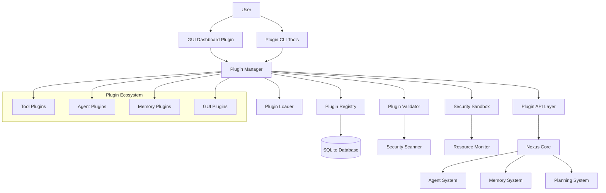

# Plugin System Overview

The Nexus AI plugin system is a revolutionary architecture that enables safe, powerful extensibility. Built from the ground up with security, performance, and developer experience in mind.

## 🎯 What's New

**Complete Plugin System Implementation** - We've just released a full-featured plugin architecture including:

- **🏗️ Plugin Architecture**: Comprehensive base classes and lifecycle management
- **🔐 Security Sandbox**: Permission-based access control and resource monitoring  
- **🌐 GUI Dashboard**: Modern web interfaces with real-time updates
- **📦 Package Management**: Installation, validation, and distribution tools
- **🛠️ Developer Tools**: Rich APIs, testing frameworks, and documentation

## Core Components

### Plugin Manager
Central orchestrator for plugin lifecycle management, dependency resolution, and coordination.

### Security Sandbox
Multi-layered security system with permission-based access control, resource monitoring, and violation tracking.

### Plugin Registry
SQLite-based metadata storage with search, discovery, and version management capabilities.

### API Layer
Secure communication bridge between plugins and Nexus core with rate limiting and permission enforcement.

### Validation System
Comprehensive security scanning, code analysis, and structure validation before plugin loading.

## Plugin Types

<CardGroup cols={2}>
  <Card title="Tool Plugins" icon="wrench" href="/plugins/types#tool-plugins">
    Extend Nexus with external integrations and utility functions
  </Card>
  <Card title="Agent Plugins" icon="robot" href="/plugins/types#agent-plugins">
    Add specialized AI agents with custom behaviors and capabilities
  </Card>
  <Card title="Memory Plugins" icon="database" href="/plugins/types#memory-plugins">
    Enhance the memory system with new storage and retrieval methods
  </Card>
  <Card title="GUI Plugins" icon="desktop" href="/plugins/types#gui-plugins">
    Create rich user interfaces and interactive dashboards
  </Card>
</CardGroup>

## Key Features

### 🔒 Security First
- **Sandboxed Execution**: Plugins run in isolated environments
- **Permission System**: Granular access control to system resources
- **Code Validation**: Static analysis and security scanning
- **Resource Limits**: Memory, CPU, and network usage monitoring

### 🚀 Developer Experience
- **Rich APIs**: Comprehensive interfaces for core system integration
- **Hot Reloading**: Update plugins without system restart
- **Type Safety**: Full Python type hints and validation
- **Testing Tools**: Built-in validation and testing frameworks

### 📦 Distribution & Management
- **Plugin Registry**: Centralized discovery and metadata management
- **Multi-Source Installation**: Local, Git, URL, and registry sources
- **Version Management**: Upgrade, rollback, and dependency tracking
- **Health Monitoring**: Real-time status and performance metrics

## Architecture Diagram



## Getting Started

<CardGroup cols={2}>
  <Card title="Quick Start Guide" icon="rocket" href="/plugins/getting-started">
    Create your first plugin in minutes
  </Card>
  <Card title="Plugin Architecture" icon="building" href="/plugins/architecture">
    Understand the plugin system design
  </Card>
  <Card title="API Reference" icon="code" href="/plugins/api/introduction">
    Explore the plugin development APIs
  </Card>
  <Card title="Examples" icon="lightbulb" href="/plugins/examples/gui-dashboard">
    Learn from real-world plugin implementations
  </Card>
</CardGroup>

## Example: GUI Dashboard Plugin

The included GUI Dashboard plugin demonstrates the full power of the plugin system:

```python
class NexusGUIDashboard(GUIPlugin):
    """Comprehensive web-based dashboard for Nexus AI."""
    
    async def start_interface(self, config: Dict[str, Any]) -> Dict[str, Any]:
        """Start the Streamlit-based web interface."""
        # Launch web server
        return {
            "status": "started",
            "url": f"http://{self.host}:{self.port}",
            "features": self.get_capabilities()
        }
    
    def get_capabilities(self) -> List[str]:
        return [
            "web_interface",
            "real_time_dashboard",
            "agent_monitoring",
            "task_visualization",
            "system_metrics"
        ]
```

**Features:**
- **Real-time Dashboard**: Live system monitoring and metrics
- **Agent Communication**: Direct interaction with AI agents
- **Task Management**: Create, track, and manage tasks
- **Memory Visualization**: Explore and search memory contents
- **Plugin Management**: Install, activate, and configure plugins

## Security Model

### Permission System
Plugins must declare required permissions and are granted only necessary access:

```yaml
# plugin.yaml
permissions:
  - "core.status"      # Read system status
  - "agents.list"      # List available agents
  - "tasks.create"     # Create new tasks
  - "memory.read"      # Read memory contents
```

### Resource Limits
Automatic monitoring and enforcement of resource usage:

```python
# Security policy example
policy = SecurityPolicy(
    plugin_name="my-plugin",
    max_memory_mb=100,
    max_cpu_time=30.0,
    max_network_requests=100,
    allowed_domains=["api.example.com"]
)
```

### Validation Pipeline
Multi-stage validation before plugin loading:

1. **Structure Validation**: Required files and manifest format
2. **Security Scanning**: Code analysis for dangerous patterns
3. **Dependency Checking**: Safe and compatible dependencies
4. **Permission Validation**: Requested permissions vs. plugin type
5. **Integrity Verification**: Checksums and signatures

## Performance

The plugin system is designed for optimal performance:

- **Lazy Loading**: Plugins loaded only when needed
- **Dependency Caching**: Shared dependencies across plugins
- **Resource Monitoring**: Real-time usage tracking
- **Efficient Communication**: Optimized API layer with minimal overhead

## Next Steps

Ready to start building? Check out our comprehensive guides:

1. **[Getting Started](/plugins/getting-started)** - Create your first plugin
2. **[Plugin Types](/plugins/types)** - Choose the right plugin type
3. **[Security Guidelines](/plugins/security)** - Build secure plugins
4. **[API Reference](/plugins/api/introduction)** - Explore available APIs

<Note>
The plugin system is designed to be both powerful and secure. All plugins run in sandboxed environments with strict permission controls to ensure system safety while enabling rich functionality.
</Note>